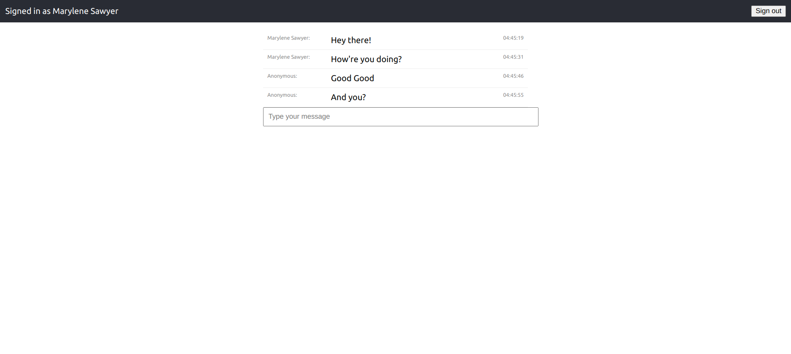

# real-time-chat-app

A real time chat app built using the Socket.io library, React and Okta.

## Table of contents

- [Overview](#overview)
  - [Screenshot](#screenshot)
  - [Links](#links)
- [My process](#my-process)
  - [Built with](#built-with)
- [Author](#author)

## Overview

### Screenshot

### Links

- Tutorial URL: [https://developer.okta.com/blog/2021/07/14/socket-io-react-tutorial](https://developer.okta.com/blog/2021/07/14/socket-io-react-tutorial)
- Article on Medium: [https://medium.com/dailyjs/combining-react-with-socket-io-for-real-time-goodness-d26168429a34](https://medium.com/dailyjs/combining-react-with-socket-io-for-real-time-goodness-d26168429a34)

### Built with

- Javascript
- Nodejs
- React.js
- Okta

## Author

- Website - [Marylene Sawyer](http://www.marylene.tech/)
- Frontend Mentor - [@Bluette1](https://www.frontendmentor.io/profile/Bluette1)
- Twitter - [@MaryleneSawyer](https://twitter.com/MaryleneSawyer)

